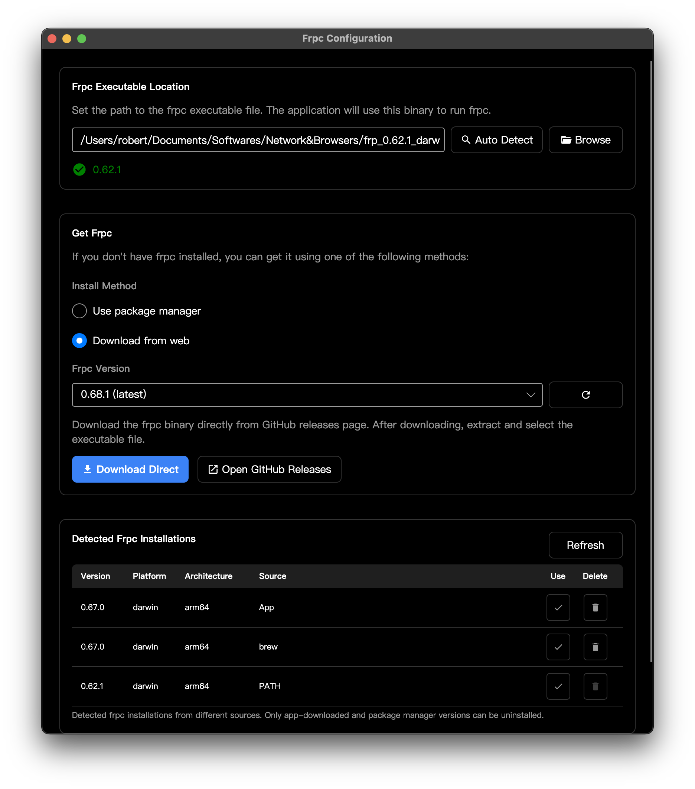
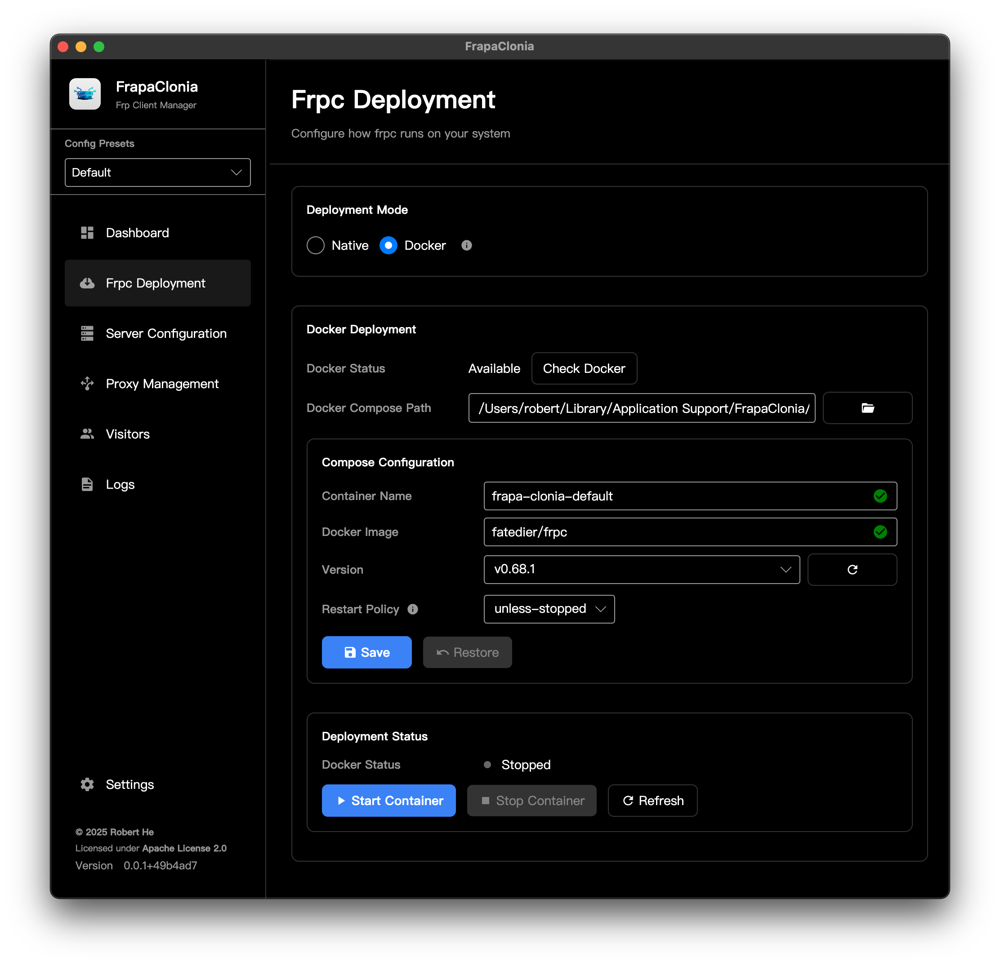
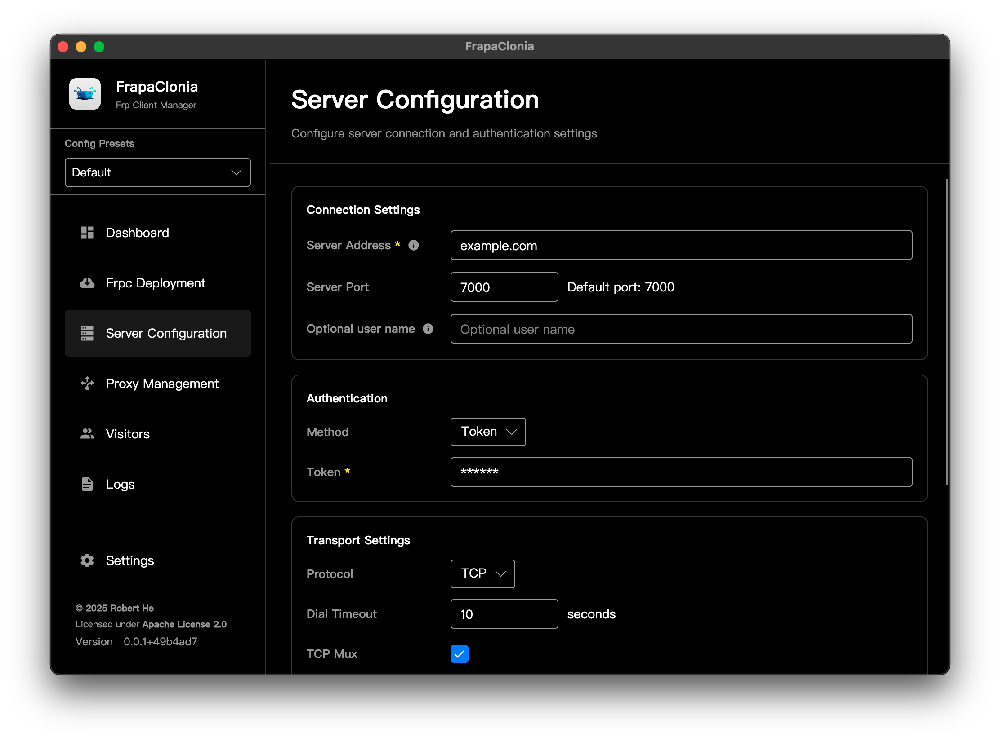
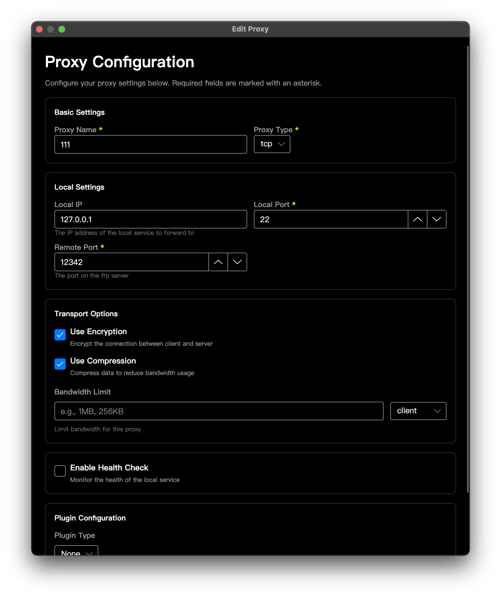

<p align="center">
  
</p>

<h1 align="center">FrapaClonia</h1>

<p align="center">
  A cross-platform desktop client for <a href="https://github.com/fatedier/frp">frp</a> (fast reverse proxy)
</p>

<p align="center">
  
  
  
  
</p>

---

## Features

- **Configuration Management** — Create, edit, and switch between multiple frpc configuration presets
- **Proxy Management** — Add, edit, and delete proxy rules (TCP, UDP, HTTP, HTTPS, STCP, XTCP, SUDP, TCPMUX)
- **Visitor Management** — Configure P2P visitor connections
- **One-Click Start/Stop** — Start and stop frpc directly or as a system service
- **Real-time Logs** — Live log viewer with search, level filtering, and auto-scroll
- **Multi-Deployment** — Deploy frpc natively or via Docker
- **System Service** — Install/uninstall frpc as a system service (launchd on macOS)
- **Dark/Light Theme** — Follows system theme with manual override
- **i18n** — Multi-language support

## Screenshots






## Download

Download the latest release from the [Releases](https://github.com/hnrobert/frapa-clonia/releases) page.

| Platform | File |
|---|---|
| Windows | `FrapaClonia-{version}-windows-x64.zip` |
| macOS (Apple Silicon) | `FrapaClonia-{version}-macos-arm64.dmg` |
| macOS (Intel) | `FrapaClonia-{version}-macos-x64.dmg` |
| Linux (x64) | `FrapaClonia-{version}-linux-x64.tar.gz` |
| Linux (ARM64) | `FrapaClonia-{version}-linux-arm64.tar.gz` |
| Linux (musl x64) | `FrapaClonia-{version}-linux-musl-x64.tar.gz` |
| Linux (musl ARM64) | `FrapaClonia-{version}-linux-musl-arm64.tar.gz` |

## Technology Stack

- **Framework**: [Avalonia UI](https://avaloniaui.net/) 11.3
- **Language**: C# / .NET 10
- **Architecture**: MVVM with [CommunityToolkit.Mvvm](https://learn.microsoft.com/dotnet/communitytoolkit/mvvm/)
- **DI**: Microsoft.Extensions.DependencyInjection
- **Logging**: Serilog
- **Icons**: [Material.Icons.Avalonia](https://github.com/AvaloniaUtils/Material.Icons.Avalonia)
- **Serialization**: Nett (TOML)
- **NativeAOT**: Enabled by default for smaller binaries

## Building from Source

### Prerequisites

- [.NET 10 SDK](https://dotnet.microsoft.com/download/dotnet/10.0)
- Platform-specific toolchain for NativeAOT (clang on macOS/Linux, MSVC on Windows)

### Build & Run

```bash
git clone https://github.com/hnrobert/frapa-clonia.git
cd frapa-clonia
dotnet restore
dotnet run --project src/FrapaClonia/FrapaClonia.csproj
```

### Publish

```bash
# macOS Apple Silicon
dotnet publish src/FrapaClonia/FrapaClonia.csproj -c Release -r osx-arm64 --self-contained

# Windows x64
dotnet publish src/FrapaClonia/FrapaClonia.csproj -c Release -r win-x64 --self-contained

# Linux x64
dotnet publish src/FrapaClonia/FrapaClonia.csproj -c Release -r linux-x64 --self-contained
```

For development builds without NativeAOT:

```bash
dotnet publish src/FrapaClonia/FrapaClonia.csproj -c Release -r osx-arm64 -p:PublishAot=false
```

## Documentation

- [Development Guide](DEVELOPMENT.md) — Architecture, services, UI components, and conventions

## License

[Apache License 2.0](LICENSE)
